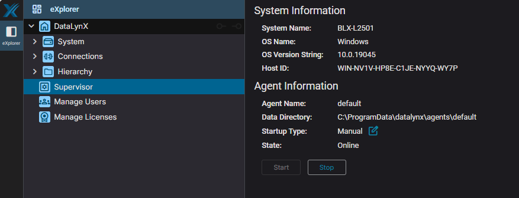

# ⚡ Quick Start Guide

**Get DataLynX running in 10 minutes.** This guide is for experienced BAS integrators who want to get up and running fast.

---

## Prerequisites

- Windows Server or Workstation with admin rights
- DataLynX `.msi` installer
- BACnet/IP network accessible from this machine
- UDP port 47808 available
- Web port 80 (or 8050/8020) available

---

## 1. Install (2 min)

1. Run the `.msi` installer
2. Accept defaults (or change web port if 80 is in use)
3. Installation creates two Windows services:
   - **DataLynX Supervisor Service**
   - **DataLynX Web Service**

---

## 2. Configure Firewall (1 min)

Open PowerShell as Administrator:

```powershell
# Web UI access (use your configured port)
New-NetFirewallRule -DisplayName "DataLynX Web UI" -Direction Inbound -Protocol TCP -LocalPort 80 -Action Allow

# BACnet/IP
New-NetFirewallRule -DisplayName "DataLynX BACnet" -Direction Inbound -Protocol UDP -LocalPort 47808 -Action Allow
```

---

## 3. Start Services & Agent (1 min)

1. Open `services.msc` → verify both DataLynX services are **Running**


2. Open browser → `http://localhost`
3. Log in with credentials provided by BuildingLogiX
4. On the **Supervisor** page → click **Start** to launch the agent
5. Wait for Explorer tree to populate



!!! note "Services ≠ Agent"
    Windows Services provide infrastructure. The **Agent** (started from Supervisor page) runs the BACnet driver.

---

## 4. Configure Hosted Device (1 min)

Navigate to: `BACnet → Hosted Device`


| Setting | Recommendation |
|---------|---------------|
| Device ID | 1530000–1530999 (BuildingLogiX range) |
| Device Name | DataLynX |

> **Note:** Device ID must be unique on your BACnet network. Verify availability before use.

---

## 5. Add BACnet/IP Network (2 min)

Navigate to: `Connections → BACnet → configuration → bacnet_networks → Add`


| Setting | Value |
|---------|-------|
| UDP Port | 47808 |
| Network Number | Unique per segment |
| Interface | Select your NIC |
| Device Type | Standard Device |

Save and ensure network shows **Enabled**.

---

## 6. Discover Devices (1 min)

1. Go to `BACnet → Devices`
2. Click `Discover → Who-Is`
3. Devices populate automatically
4. Click any device to browse points


---

## 7. Connect to BDX (1 min)

Navigate to: `Connections → BDX → bdx_agent`


| Setting | Value |
|---------|-------|
| BDX URL | Your BDX endpoint |
| Agent ID | Provided by BuildingLogiX |
| Password | Provided by BuildingLogiX |

Enable connection → verify status shows **Connected**.

---

## 8. Create First BasiX Mapping (1 min)

1. Navigate to: `System → BasiX → mapping_schemes`
2. Select a profile (VAV, AHU, etc.)
3. Configure path patterns to match your BACnet naming
4. Map required fields to BACnet points
5. Publish device to BDX


---

## You're Done!

DataLynX is now:

- ✅ Reading BACnet devices
- ✅ Connected to BDX
- ✅ Ready for BasiX mapping

---

## Quick Reference

| Task | Location |
|------|----------|
| Start/Stop Agent | Supervisor page |
| View devices | BACnet → Devices |
| Configure polling | BACnet → Networks → Poll Service |
| BasiX mappings | System → BasiX → mapping_schemes |
| User management | System → Users |
| Logs | `C:\ProgramData\DataLynX\agents\default\logs\` |
| Config file | `C:\ProgramData\DataLynX\agents\default\datalynx.cfg` |

---

## Common Issues

| Problem | Solution |
|---------|----------|
| UI won't load | Check Web Service running, verify firewall port |
| No devices found | Check UDP 47808, verify network interface selection |
| Agent won't start | Check Supervisor Service, review logs |
| BDX offline | Verify URL, credentials, outbound connectivity |

---

## Next Steps

- **[Full Installation Guide](installation.md)** — Detailed setup instructions
- **[First BACnet Network](first-bacnet-network.md)** — Complete network configuration
- **[BasiX Mapping Workflow](../user-guide/basix-mapping-workflow.md)** — Comprehensive mapping guide
- **[FAQ](../faq.md)** — Troubleshooting common issues

