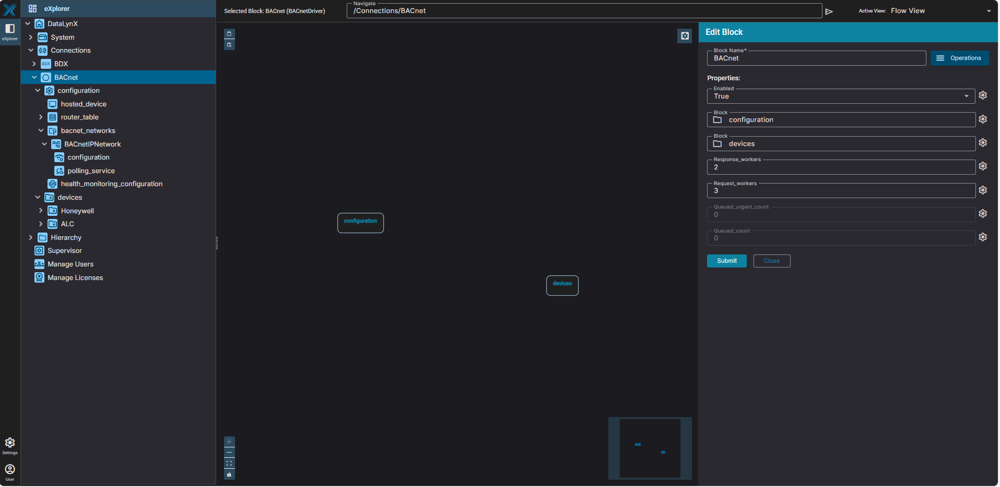
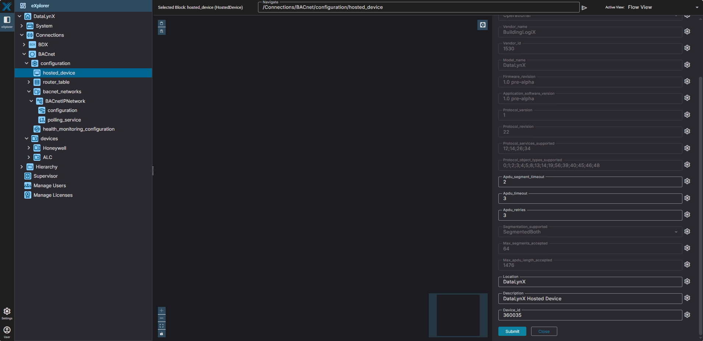
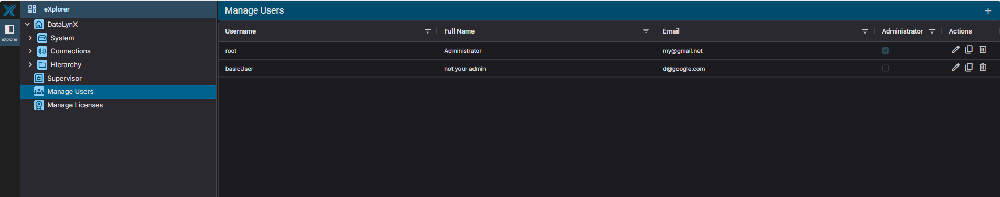
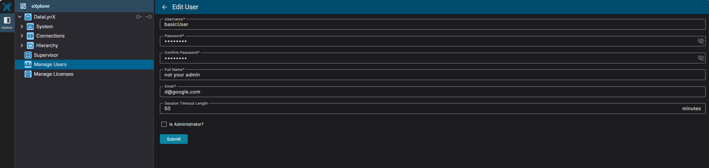
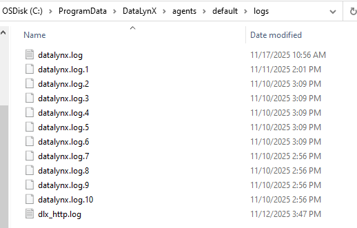

# { width="150" } DataLynX UI Tour

This guide provides a visual walkthrough of the DataLynX User Interface, including navigation structure, key screens, configuration pages, and diagnostic views.  
Use this as a reference when learning the platform or training new users.

---

## 🧭 1. UI Navigation Overview

When you access the DataLynX UI (typically at `http://localhost` on port 80, or alternatively port 8050 or 8020), you will see a clean, organized navigation structure consisting of:

- **Explorer Tree (Left Pane)**
  Shows drivers, networks, devices, BasiX mappings, system tools, and settings.

- **Main Content Area (Center)**
  Displays device lists, configuration pages, network settings, logic flows, and more.

- **Toolbox / Properties Pane (Right Pane)**
  Provides contextual tools such as block insertion, or the Properties Pane (Edit Block panel) when a block is selected.

- **Active View Toggle (Top Right)**
  Dropdown to switch between different view modes for the selected block.

---

## 🏠 2. Explorer Parent Nodes

The Explorer tree is the primary navigation tool in DataLynX. When you first log in with the agent running, you'll see these **parent nodes**:


### **Top-Level Structure:**

| Node | Purpose | What You'll Find |
|------|---------|------------------|
| **System** | System configuration | BasiX mapping schemes, backup service |
| **Connections** | Communication drivers | BDX connection, BACnet driver & devices |
| **Hierarchy** | Digital twin workspace | Custom logic, calculations, BasiX profiles |
| **Supervisor** | Agent control | Start/Stop agent, view status |
| **Manage Users** | User administration | Create users, assign roles |
| **Manage Licenses** | License management | Activation, entitlements |

### **Where to Navigate for Common Tasks:**

| Task | Navigate To |
|------|-------------|
| Start/stop the agent | **Supervisor** |
| Configure BACnet network | **Connections → BACnet → configuration** |
| Discover BACnet devices | **Connections → BACnet → devices** |
| Connect to BDX | **Connections → BDX** |
| Create BasiX mapping schemes | **System → BasiX → mapping_schemes** |
| Build custom logic/calculations | **Hierarchy → [Your folders]** |
| Manage user accounts | **Manage Users** |
| Configure backups | **System → backup_service** |

For detailed information, see [Explorer Structure Guide](explorer-structure.md).

---

## 🌐 3. BACnet Configuration

BACnet configuration consists of several key sections:

---

## 3.1 BACnet Driver

Used to enable or disable the BACnet driver and view driver-level status.



---

## 3.2 BACnet IP Network Configuration

Here you configure:

- UDP port  
- Interface binding  
- Device type (Standard, Foreign Device)  
- Network number  
- Registration settings  


Additional configuration options such as polling, discovery, and health monitoring can be found here.


---

## 3.3 Router Table

Shows automatically discovered or manually added BACnet router entries.


---

## 🔍 4. Device Discovery

After configuring your network, use the **Device Discovery** section to scan the BACnet network.


---

## 📟 5. BACnet Device List

All discovered devices appear in the Devices view:


---

## 🔧 6. Point Discovery Within Devices

Each device exposes object lists.  
The point discovery screen shows details for each point, including:

- Present value  
- Units  
- Status  
- Reliability  
- Priority array (when applicable)


---

## 🔄 7. View Modes & Active View Toggle

DataLynX provides multiple **view modes** for working with blocks. You can switch between views using the **Active View** dropdown in the **top-right corner** of the screen.

### **How to Switch Views:**

1. Select a block in the Explorer or Flow View
2. Look at the **top-right corner** of the screen
3. Click the **Active View** dropdown (shows current view name)
4. Select the desired view mode

---

## 7.1 Flow View

The default visual workspace showing blocks as draggable components with connections.

**Use Flow View to:**

- Build and visualize logic flows
- Drag blocks from the Toolbox
- Connect blocks with links
- See the overall structure of your logic


Notice the **"Active View: Flow View"** dropdown in the top-right corner.

**Right Pane:** When in Flow View, the right pane shows:

- **Toolbox** - Block categories you can drag into the workspace
- **Properties Pane (Edit Block)** - Appears when you select a block


For detailed information about blocks and categories, see [Toolbox Block Reference](../reference/toolbox-blocks.md).

---

## 7.2 Property View

A full-page list view showing **all properties** of the selected block in detail.

**Use Property View to:**

- See all inputs and outputs for a block
- View detailed status for each property
- Configure multiple properties at once
- Debug values and check for NULL inputs


Notice the **"Active View: Property View"** in the top-right corner.

**Key Features:**

- All inputs listed (In_1 through In_16 for aggregate blocks)
- Status column shows OK, NULL, or error states
- Checkbox to mark properties as "null" (unused)
- Output value shown at the bottom

---

## 7.3 Link View

A table view showing **all connections (links)** into and out of the selected block.

**Use Link View to:**

- See all blocks connected to the selected block
- Check link properties (Propagate Units, Propagate Range, Is Active)
- Debug data flow issues
- Manage multiple links at once


Notice the **"Active View: Link View"** in the top-right corner.

**Columns:**
| Column | Description |
|--------|-------------|
| **Source** | The block providing data |
| **Source Property** | Which output property (usually `out`) |
| **Target** | The block receiving data |
| **Target Property** | Which input property (in_1, in_2, etc.) |
| **Propagate Units** | Whether units flow through the link |
| **Propagate Range** | Whether range limits flow through |
| **Is Active** | Whether the link is currently active |

---

## 7.4 Mapping Editor (BasiX)

A specialized view for configuring BasiX mapping schemes.

**Use Mapping Editor to:**

- Define paths to BACnet points
- Configure which property to read
- Set up input properties for BasiX fields
- Link Hierarchy blocks to profile fields

This view appears when working with mapping schemes under:
```
System → BasiX → mapping_schemes → [Device Type]
```

---

## 7.5 Properties Pane (Edit Block Panel)

When you select a block in **any view**, the **Properties Pane** appears on the right side, labeled **"Edit Block"**.

**The Properties Pane shows:**

- Block name (editable)
- Block-specific properties
- Input/output configuration
- Submit and Close buttons

This panel allows quick edits without switching to Property View.

**Key Difference:**

- **Properties Pane** = Quick access side panel (always available)
- **Property View** = Full-page detailed view (via Active View dropdown)

---

## 🧬 8. BasiX Mapping

Mapping nodes let you configure BasiX Profiles and link BACnet points to BasiX standard fields.



---

## 👤 9. User Administration

DataLynX supports multiple user roles and privileges.

### User Overview  
Shows list of users with role, username, and authentication settings.



### User Details  
Configure passwords, role levels, and account options.



---

## 💾 10. System Tools & Backup

DataLynX includes system maintenance tools for:

- Backup & restore  
- Engine snapshots  
- Agent service visibility  
- Diagnostics  


---

## 🧩 11. Windows Services & File Locations (Reference)

Diagnostics views provide insight into:

- Log locations  
- Config file locations  
- Service status  





---

## 🎨 12. Theme & Personalization

Users can optionally change the theme and appearance of the UI.


---

## 📝 Summary

The User Interface provides:

- Complete visibility into BACnet networks
- Configuration tools for drivers, networks, users, and BasiX
- Visual logic development via Flow View and the Toolbox
- Health monitoring and diagnostics
- System-level maintenance and backups

Together, these tools create a powerful standalone integration platform.

---

## ➡️ Next Step

Proceed to **[BACnet Integration Workflow](bacnet-integration.md)**
to learn how to use these UI components to complete a full, end-to-end integration.

